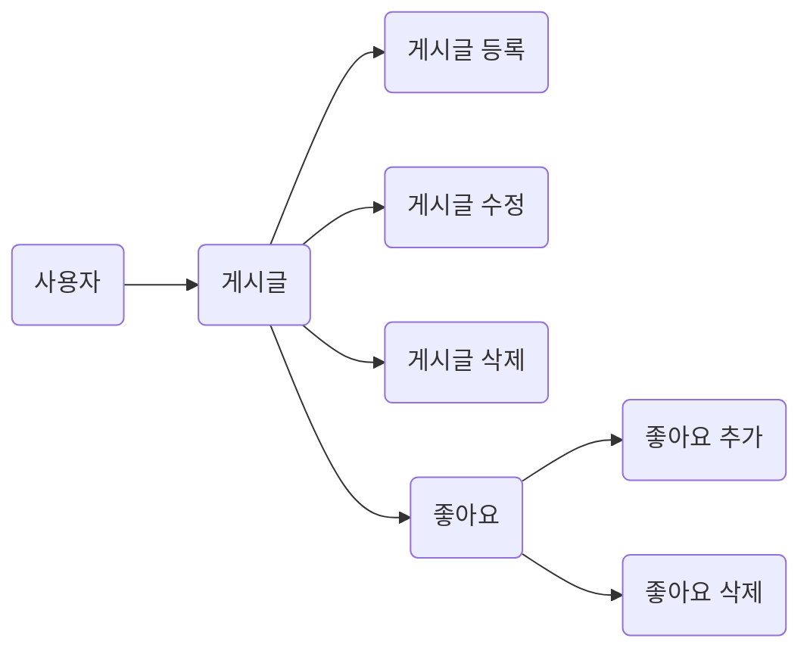

# 5기 6조 박민우
**Magazine**

## 😀프로젝트 소개 
### 제작 기간
- 제작기간 :  2022.02. 18 - 

	**Requirement**
1. 프론트엔드와 API list 논의하여 정하고 맞춰서 구현하기    
2. 회원 가입 페이지
    - 닉네임은 최소 3자 이상, 알파벳 대소문자(a ~ z, A ~ Z), 숫자(0 ~ 9)로 구성하기
    - 비밀번호는 최소 4자 이상, 닉네임과 같은 값이 포함된 경우 회원가입에 실패로 만들기
    - 비밀번호 확인은 비밀번호와 정확하게 일치하기
3. 로그인 페이지
    - 로그인 버튼 누른 경우 닉네임과 비밀번호가 DB에 등록됐는지 확인하기
    - 하나라도 맞지 않는 정보가 있을 때, "닉네임 또는 패스워드를 확인해주세요" 메세지 전달하는 예외처리 하기
4. 로그인 검사
    - 로그인 하지 않은 사용자도, 게시글 목록 조회 가능하도록 하기
    - 로그인 하지 않은 사용자가 좋아요 버튼 눌렀을 경우, "로그인이 필요합니다."라는 메세지 전달하는 예외처리 하기
    - 로그인 한 사용자가 로그인 페이지 또는 회원가입 페이지에 접속한 경우 "이미 로그인이 되어있습니다."라는 메세지 전달하는 예외처리 하기
5. CORS 해결하기
    - CORS란 무엇이며, 어떤 상황에서 일어나는지 / 어떻게 해결하는지 알아보고, 프로젝트에 적용하기
6. N+1 문제 해결하기
    - N+1 문제란 무엇이고, 우리 프로젝트에서 N+1 문제에 해당하는 내용 있는지 알아보고 있다면 해결하기
			
## 🔨개발툴

+ Language
	+ JAVA 8
- Framework
	- SpringBoot
+ DB
	+ MySql, h2
* SERVER
	* AWS EC2 (Ubuntu)
- 사용 스택
	- JPA
- 기타
	- git, notion
---

### ERD 설계
 
---

### FLOW

---

## API설계

### Account(회원관리)
|                |Http Method   |URL                |
|----------------|--------------|-------------------|
|회원가입	     |`POST`         |/api/register     |
|로그인          |`POST`         |/api/login        |

**Request**
```
- 회원가입 :
{ "account_email" : "account_email",
  "account_name" : "account_name",
  "password" : "password", 
  "password_check" : "password" }
- 로그인 : 
{ "account_email" : "account_email", 
  "password" : "password" }
```
**Response**
```
- 회원가입 : 
{ "result" : "success"/"fail", 
  "msg" : "msg" }
- 로그인 : 
{ "result" : "success"/"fail", 
  "msg" : "msg", 
  "data" : [{ 
  	"account_id" : "account_id",
	"account_email" : "account_email",
	"account_name" : "account_name",
	"like_board" : [{
			"board_id" : "board_id", ],
			"token" : "token(HS512알고리즘)" }] }
```

---

### Board(게시판)
|                |Http Method   |URL                 |
|----------------|--------------|--------------------|
|게시글 전체 조회|`GET`         |/api/board           |
|게시글 등록     |`POST`        |/api/board           |
|게시글 수정     |`PUT`         |/api/board/{boardId} |
|게시글 삭제     |`DELETE`      |/api/board/{boardId} |

**Request**
```
- 게시글 등록 :
{ "content" : "content",
  "img_url" : "img_url",
  "board_status" : "board_status" }
- 게시글 수정 :
{ "content" : "content",
  "img_url" : "img_url",
  "board_status" : "board_status" }
```
**Response**
```
- 게시글 전체 조회 :
{ "result" : "success"/"fail",
  "msg" : "msg",
  "data" : [{
	"account_id" : "account_id",
	"account_email" : "account_email",
	"board_id" : "board_id",
	"content" : "content",
	"like" : "like",
	"like_account" : [{
		"account_id" : "account_id", ],
	"time" : "time",
	"img_url" : "img_url",
	"board_status" : "board_status" }] }
- 게시글 등록 :
{ "result" : "success"/"fail",
  "msg" : "msg",
  "data" : {
  	"board_id" : "board_id" } }
- 게시글 수정 :
{ "result" : "success"/"fail",
  "msg" : "msg" }
- 게시글 삭제 :
{ "result" : "success"/"fail",
  "msg" : "msg" }
```
---

### LikePost(좋아요)
|                   |Http Method   |URL                        |
|-------------------|--------------|---------------------------|
|게시글 좋아요 추가  |`POST`        |/api/board/like/{boardId} |
|게시글 좋아요 삭제  |`DELETE`      |/api/board/like/{boardId} |

**Request**
```
- 게시글 좋아요 추가 : 
{ "like_id" : "["account_id"]" }
```
**Response**
```
- 게시글 좋아요 추가 : 
{ "result" : "success"/"fail",
  "msg" : "msg", 
  "data" : { 
	"like" : "like" } }
- 게시글 좋아요 추가 :
{ "result" : "success"/"fail",
  "msg" : "msg",
  "data" : {
  	"like" : "like" } }
```
---

### 회고
> 버티고 버텨 !!!
> 
> (1차 과제를 마치고 2차로 넘어왔다. 분명히 .. 지금 하고 있는 것도 CRUD 아닌가???)

로그인 기능 앞에 처절하게 무너진 시간들이었다. 처음에 강의를 보면서 security를 이용할까 했지만 도무지 이해가 되지 않았다.

스프링에 내장되어 있는 security를 일일이 이해할 용기가 없었던 것일 수도 있겠다.

그래서 처음부터 jwt, token 방식을 찾아보고 공부하면서 하나 하나 쌓아갔다. 그런데 .......... 계속 안 됐다.

여러 레퍼런스를 참고하다가 섞여서 안 되고, 이해를 못해서 안 되고, 프로젝트를 다시 열고, 또 다시 열고

그러던 중 임신한 와이프가 코로나에 걸렸다.

나도 코로나 인가 ..? 어떻게든 옆에 있어주랴, 공부하랴, jwt는 안 되고 .. 그러다 엄청난 스트레스였는지, 코로나인지. 두통이 심하게 왔다.

컴퓨터 빛을 볼 수가 없었다. 그래서 컴퓨터를 덮었다.

나의 2차 과제가 날아갔다.

항해에 대한 고민이 들 정도로 내가 이걸 할 수 있는 사람이 맞을까 고민이 들었다.

하루 그리고 반 정도를 지나보낸 뒤에야 다시 컴퓨터 앞에 앉을 수 있었다.


천천히 하나 하나 해보자는 생각으로 builder 를 적용하면서 (4차 과제 선제 적용) 코드를 짰다.

jwt도 검증된 걸로 최소한으로 수정해서 그대로 입혔다. 이걸 뜯어보는 것보다 일단 서버가 돌아가게 하는 것이 중요했다.

그러면서 authority 와 account 의 many to many 가 생겼다. (이 부분이 제일 아쉽다)

만들어준 authority가 token을 만드는 스프링 내장 함수에 사용되어서 떼어내지 못하였고,

authority는 account와 many to many로 묶여있어서 db에 authority를 사용할 수 있게끔 시작 전 admin 데이터를 넣어주어야 했다.

sql 파일을 만들어서 yml 파일 설정으로 초기화를 하려다 h2 에서는 되었는데 MySQL 연결 시 계속 에러가 떠서

MySQL workbench를 이용해서 직접 쿼리문을 넣어주어 데이터를 형성시켜서 서버를 돌릴 수 있었다.

DB에 대해서도 더 공부하고 싶다는 생각이 들 수밖에 없었다.


request, response 모두 dto를 만들어서 entity를 건드리지 않으려고 하면서 N+1 문제는 비켜갔다.

하지만 builder 사용에 대한 정확한 목적과 N+1 문제에 대해서도 더 공부해야 할 것 같다.

CORS 역시 간단한 적용으로 바로 프론트와 붙여볼 수 있었다.

token이 제대로 넘어가지 않는다, 라는 문제가 몇 차례 일어났지만 'Baerer ' 설정과 같은 것들을 맞추면서 해결해나갔다.


이번 과제를 하면서 정말 많은 생각을 했지만, 다시 일어나려는 시점이 보다 늦지 않았나 싶어 생각을 정리할 시간이 없었다.

다른 무엇보다 멘탈적으로 드는 생각은 버티자. 그리고 하나씩 하나씩 해보자. 라는 것이었고,

코드를 짜는 데 있어서는 많이 깊이 공부도 하고 싶지만, 리팩토링을 잘 해서 정말 코드를 예쁘게 짜고 싶다는 생각을 많이 하게 된 것 같다.


이제야 테스트코드를 공부해야 한다. 그리고 exception 부분을 리팩토링 하고 싶다.

프론트가 무한스크롤을 하려면 페이징도 구현해야 한다.

다시, 하나씩 하나씩 해보자.

---
